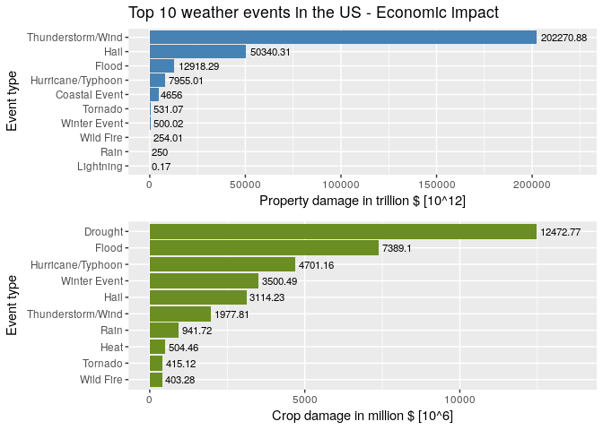

# Introduction

Storms and other severe weather events can cause both public health and economic problems for communities and municipalities. Many severe events can result in fatalities, injuries, and property damage, and preventing such outcomes to the extent possible is a key concern.

This project involves exploring the U.S. National Oceanic and Atmospheric Administration's (NOAA) storm database. This database tracks characteristics of major storms and weather events in the United States, including when and where they occur, as well as estimates of any fatalities, injuries, and property damage.

# Data

The data for this assignment come in the form of a comma-separated-value file compressed via the bzip2 algorithm to reduce its size. You can download the file from the course web site:

* [Storm Data](https://d396qusza40orc.cloudfront.net/repdata%2Fdata%2FStormData.csv.bz2 "StormData.csv.bz2") [47Mb]

There is also some documentation of the database available. Here you will find how some of the variables are constructed/defined.

* [National Weather Service Storm Data Documentation](https://d396qusza40orc.cloudfront.net/repdata%2Fpeer2_doc%2Fpd01016005curr.pdf "pd01016005curr.pdf")
* [National Climatic Data Center Storm Events FAQ](https://d396qusza40orc.cloudfront.net/repdata%2Fpeer2_doc%2FNCDC%20Storm%20Events-FAQ%20Page.pdf "FNCDC_Storm_Events-FAQ_Page.pdf")

The events in the database start in the year 1950 and end in November 2011. In the earlier years of the database there are generally fewer events recorded, most likely due to a lack of good records. More recent years should be considered more complete.


# Analysis

## Initial checks

First of all, we need to check the libraries present in the system:

```r
# Author <- "José Mª Sebastián Carrillo"

if (!require('plyr')) {
    stop('The package plyr was not installed!')
}
```

```
## Loading required package: plyr
```

```r
if (!require('dplyr')) {
    stop('The package dplyr was not installed!')
}
```

```
## Loading required package: dplyr
```

```
## 
## Attaching package: 'dplyr'
```

```
## The following objects are masked from 'package:plyr':
## 
##     arrange, count, desc, failwith, id, mutate, rename, summarise,
##     summarize
```

```
## The following objects are masked from 'package:stats':
## 
##     filter, lag
```

```
## The following objects are masked from 'package:base':
## 
##     intersect, setdiff, setequal, union
```

```r
if (!require('ggplot2')) {
  stop('The package ggplot2 was not installed!')
}
```

```
## Loading required package: ggplot2
```

```r
if (!require('gridExtra')) {
  stop('The package gridExtra was not installed!')
}
```

```
## Loading required package: gridExtra
```

```
## 
## Attaching package: 'gridExtra'
```

```
## The following object is masked from 'package:dplyr':
## 
##     combine
```


And the, check if the raw data is in our system, and if the answer is not, download and uncompress it.


```r
currentFolder <- getwd()
dataFileCompressed <- "StormData.csv.bz2"

# Verify the file downloaded
if (!file.exists(dataFileCompressed)){
    dataFileCompressedUrl <- "https://d396qusza40orc.cloudfront.net/repdata%2Fdata%2FStormData.csv.bz2"
    download.file(dataFileCompressedUrl, dataFileCompressed, method="curl")
}
```

## Data Processing

### Loading the data

Extract the data from the compressed file and store it in a variable, but only the columns that would apply to our analysis, in this case:

* STATE: State events took place
* EVTYPE: Event Type (e.g. tornado, flood, etc.)
* FATALITIES: Number of fatalities
* INJURIES: Number of injuries
* PROPDMG: Property damage estimates, entered as actual dollar amounts
* PROPDMGEXP: Alphabetic Codes to signify magnitude “K” for thousands, “M” for millions, and “B” for billions)
* CROPDMG: Crop damage estimates, entered as actual dollar amounts
* CROPDMGEXP: Alphabetic Codes to signify magnitude “K” for thousands, “M” for millions, and “B” for billions)

```r
rawData <- read.csv(bzfile(dataFileCompressed))
workDataset <- rawData[,c("STATE", "EVTYPE", "FATALITIES", "INJURIES", "PROPDMG","PROPDMGEXP","CROPDMG","CROPDMGEXP")]
str(workDataset)
```

```
## 'data.frame':	902297 obs. of  8 variables:
##  $ STATE     : Factor w/ 72 levels "AK","AL","AM",..: 2 2 2 2 2 2 2 2 2 2 ...
##  $ EVTYPE    : Factor w/ 985 levels "   HIGH SURF ADVISORY",..: 834 834 834 834 834 834 834 834 834 834 ...
##  $ FATALITIES: num  0 0 0 0 0 0 0 0 1 0 ...
##  $ INJURIES  : num  15 0 2 2 2 6 1 0 14 0 ...
##  $ PROPDMG   : num  25 2.5 25 2.5 2.5 2.5 2.5 2.5 25 25 ...
##  $ PROPDMGEXP: Factor w/ 19 levels "","-","?","+",..: 17 17 17 17 17 17 17 17 17 17 ...
##  $ CROPDMG   : num  0 0 0 0 0 0 0 0 0 0 ...
##  $ CROPDMGEXP: Factor w/ 9 levels "","?","0","2",..: 1 1 1 1 1 1 1 1 1 1 ...
```

### Transform the data

In this moment we can analyze the distinct types of event fatalities that we have in the dataset.

```r
# Show only a few for visualizatie more easily first time (document too long).
head(unique(workDataset$EVTYPE), n = 20L)
```

```
##  [1] TORNADO                   TSTM WIND                
##  [3] HAIL                      FREEZING RAIN            
##  [5] SNOW                      ICE STORM/FLASH FLOOD    
##  [7] SNOW/ICE                  WINTER STORM             
##  [9] HURRICANE OPAL/HIGH WINDS THUNDERSTORM WINDS       
## [11] RECORD COLD               HURRICANE ERIN           
## [13] HURRICANE OPAL            HEAVY RAIN               
## [15] LIGHTNING                 THUNDERSTORM WIND        
## [17] DENSE FOG                 RIP CURRENT              
## [19] THUNDERSTORM WINS         FLASH FLOOD              
## 985 Levels:    HIGH SURF ADVISORY  COASTAL FLOOD ... WND
```

```r
# If you want to show all the values, use the next instruction instead the above
# unique(workDataset$EVTYPE)
```

Now, we can aggregate the events types.

```r
# Transforms (force) the data into text
workDataset$EVTYPE<-as.character(workDataset$EVTYPE)
# Change the literals
workDataset[grep("DROUGHT", workDataset$EVTYPE,ignore.case = T),"EVTYPE"] <-"Drought"
workDataset[grep("URBAN|STREAM|FLOOD",
                 workDataset$EVTYPE,ignore.case = T),"EVTYPE"] <-"Flood"
workDataset[grep("HAIL", workDataset$EVTYPE,ignore.case = T),"EVTYPE"] <-"Hail"
workDataset[grep("FOG", workDataset$EVTYPE,ignore.case = T),"EVTYPE"] <-"Fog"
workDataset[grep("AVALANC", workDataset$EVTYPE,ignore.case = T),"EVTYPE"] <-"Avalanche"
workDataset[grep("LIG", workDataset$EVTYPE,ignore.case = T),"EVTYPE"] <-"Lightning"
workDataset[grep("FIRE", workDataset$EVTYPE,ignore.case = T),"EVTYPE"] <-"Wild Fire"
workDataset[grep("WARM|HEAT", workDataset$EVTYPE,ignore.case = T),"EVTYPE"] <-"Heat"
workDataset[grep("SLUMP|SLIDE", workDataset$EVTYPE,ignore.case = T),"EVTYPE"] <-"Landslide"
workDataset[grep("FUNNEL|DUST DEVIL|WHIRLWIND|LANDSPOUT|WATERSPOUT|TORN|NADO",
                 workDataset$EVTYPE,ignore.case = T),"EVTYPE"] <-"Tornado"
workDataset[grep("HURRICANE|TYPHOON|TROP",
                 workDataset$EVTYPE,ignore.case = T),"EVTYPE"] <-"Hurricane/Typhoon"
workDataset[grep("BEACH|SWELL|SEICHE|TSUNAMI|SEA|COAST|RIP|WAVE|SUR|TID",
                 workDataset$EVTYPE,ignore.case = T),"EVTYPE"] <-"Coastal Event"
workDataset[grep("HYPOTHERMIA|SLEET|GLAZE|LOW TEMPERATURE|FREEZ|FROST|SNOW|BLIZZARD|WINT|ICE|ICY|COLD",
                 workDataset$EVTYPE,ignore.case = T),"EVTYPE"] <-"Winter Event"
workDataset[grep("DAM|WET|MIX|PRECIPITATION|WATER|RAIN|SHOWER",
                 workDataset$EVTYPE,ignore.case = T),"EVTYPE"] <-"Rain"
workDataset[grep("DUST|WIND|BURST|HIGH|TSTM|THUN|APACHE COUNTY",
                 workDataset$EVTYPE,ignore.case = T),"EVTYPE"] <-"Thunderstorm/Wind"
workDataset[grep("OTHER|MARINE|SMOKE|VOLCANIC|TURBULENCE|DROWNING|\\?",
                 workDataset$EVTYPE,ignore.case = T),"EVTYPE"] <-"Other"
# Convert to factor
workDataset$EVTYPE<-factor(workDataset$EVTYPE)
# Show the changes
summary(workDataset$EVTYPE)
```

```
##    Thunderstorm/Wind                 Hail                Flood 
##               362839               290400                86146 
##              Tornado         Winter Event            Lightning 
##                71697                46415                15988 
##                 Rain            Wild Fire                 Heat 
##                12036                 4239                 2958 
##        Coastal Event              Drought                  Fog 
##                 2760                 2512                 1883 
##    Hurricane/Typhoon            Landslide            Avalanche 
##                 1056                  648                  388 
##                Other   Temperature record   Record temperature 
##                  108                   43                   11 
##                  DRY       DRY CONDITIONS          RECORD COOL 
##                    9                    6                    5 
##   RECORD TEMPERATURE  ROTATING WALL CLOUD           WALL CLOUD 
##                    5                    5                    5 
##            DRY SPELL          DRY WEATHER  MONTHLY TEMPERATURE 
##                    4                    4                    4 
##           RECORD LOW  RECORD TEMPERATURES       ABNORMALLY DRY 
##                    4                    3                    2 
##          Hot and Dry            HOT SPELL                 NONE 
##                    2                    2                    2 
##       RECORD DRYNESS  Record Temperatures    RED FLAG CRITERIA 
##                    2                    2                    2 
##    REMNANTS OF FLOYD    Summary August 10    Summary August 11 
##                    2                    2                    2 
##  Summary of April 12  Summary of April 21   Summary of June 13 
##                    2                    2                    2 
##    Summary of June 3  Summary of March 23 Summary September 23 
##                    2                    2                    2 
##     Summary: Nov. 16             VERY DRY           COOL SPELL 
##                    2                    2                    1 
##         DRIEST MONTH      DRY HOT WEATHER          DRY PATTERN 
##                    1                    1                    1 
##              DRYNESS            EXCESSIVE      EXCESSIVELY DRY 
##                    1                    1                    1 
##      FLASH FLOOODING  HEAVY PRECIPATATION          HOT PATTERN 
##                    1                    1                    1 
##          HOT WEATHER      HOT/DRY PATTERN     LARGE WALL CLOUD 
##                    1                    1                    1 
##  Metro Storm, May 26 Mild and Dry Pattern         MILD PATTERN 
##                    1                    1                    1 
##     MILD/DRY PATTERN    No Severe Weather     Record dry month 
##                    1                    1                    1 
##            SOUTHEAST    Summary August 17   Summary August 2-3 
##                    1                    1                    1 
##    Summary August 21    Summary August 28     Summary August 4 
##                    1                    1                    1 
##     Summary August 7     Summary August 9       Summary Jan 17 
##                    1                    1                    1 
##   Summary July 23-24   Summary June 18-19     Summary June 5-6 
##                    1                    1                    1 
##       Summary June 6  Summary of April 13  Summary of April 27 
##                    1                    1                    1 
## Summary of April 3rd  Summary of August 1   Summary of July 11 
##                    1                    1                    1 
##    Summary of July 2   Summary of July 22   Summary of July 26 
##                    1                    1                    1 
##   Summary of July 29    Summary of July 3   Summary of June 10 
##                    1                    1                    1 
##   Summary of June 11   Summary of June 12   Summary of June 15 
##                    1                    1                    1 
##   Summary of June 16   Summary of June 18   Summary of June 23 
##                    1                    1                    1 
##   Summary of June 24   Summary of June 30    Summary of June 4 
##                    1                    1                    1 
##              (Other) 
##                   28
```

The next thing we should do is convert the numeric data codes (PROPDMGEXP and CROPDMGEXP), that multiplies the normal numeric values (PROPDMG and CROPDMG), to a normalized value in dollars.
For this, we need to know wich are the values

```r
table(workDataset$CROPDMGEXP)
```

```
## 
##             ?      0      2      B      k      K      m      M 
## 618413      7     19      1      9     21 281832      1   1994
```

```r
table(workDataset$PROPDMGEXP)
```

```
## 
##             -      ?      +      0      1      2      3      4      5 
## 465934      1      8      5    216     25     13      4      4     28 
##      6      7      8      B      h      H      K      m      M 
##      4      5      1     40      1      6 424665      7  11330
```

Now we can construct a function that will make the "decode" this values to a numeric ones (in desc. order of appearances).

```r
decodeExponent <- function(value) {
    if (value == "") return(0)
    else if (value %in% c("k", "K"))
        return(3)
    else if (value %in% c("m", "M"))
        return(6)
    else if (!is.na(as.numeric(value))) 
        return(as.numeric(value))
    else if (value %in% c("b", "B"))
        return(9)
    else if (value %in% c("h", "H"))
        return(2)
    else if (value %in% c("-", "?", "+"))
        return(0)
    else return(0)
}
```

So we can use no the previous function to transform the data.

```r
# Property damages
propExponent <- sapply(workDataset$PROPDMGEXP, FUN=decodeExponent)
workDataset$Property_Damage <- workDataset$PROPDMG * (10 ** propExponent)
# Crop damages
cropExponent <- sapply(workDataset$CROPDMGEXP, FUN=decodeExponent)
workDataset$Crop_Damage <- workDataset$CROPDMG * (10 ** cropExponent)
# Total damages
workDataset$Total_Damage <- workDataset$Property_Damage + workDataset$Crop_Damage
```

We start to construct the final dataset, contains the information that we'll show after, renaming the column names for more clear analysis.

```r
weatherEvents <- workDataset[,c("STATE", "EVTYPE", "FATALITIES", "INJURIES",
                                "Property_Damage","Crop_Damage", "Total_Damage")]
names(weatherEvents)[names(weatherEvents) == 'STATE'] <- 'State'
names(weatherEvents)[names(weatherEvents) == 'EVTYPE'] <- 'Event_Type'
names(weatherEvents)[names(weatherEvents) == 'FATALITIES'] <- 'Fatalities'
names(weatherEvents)[names(weatherEvents) == 'INJURIES'] <- 'Injuries'
str(weatherEvents)
```

```
## 'data.frame':	902297 obs. of  7 variables:
##  $ State          : Factor w/ 72 levels "AK","AL","AM",..: 2 2 2 2 2 2 2 2 2 2 ...
##  $ Event_Type     : Factor w/ 127 levels "ABNORMALLY DRY",..: 120 120 120 120 120 120 120 120 120 120 ...
##  $ Fatalities     : num  0 0 0 0 0 0 0 0 1 0 ...
##  $ Injuries       : num  15 0 2 2 2 6 1 0 14 0 ...
##  $ Property_Damage: num  25000 2500 25000 2500 2500 2500 2500 2500 25000 25000 ...
##  $ Crop_Damage    : num  0 0 0 0 0 0 0 0 0 0 ...
##  $ Total_Damage   : num  25000 2500 25000 2500 2500 2500 2500 2500 25000 25000 ...
```

### Working with the data

Using this dataset, we can aggregate the data by the target columns, making the final datasets used for represntation.

First we summarize the health damages, sorting in descendant order, and removing the values that have not impact.

```r
# Health fatalities
healthFatalities <- ddply(weatherEvents, .(Event_Type), summarize,
                          Fatalities = sum(Fatalities))
# Remove data with no impact
healthFatalities <- healthFatalities[(healthFatalities$Fatalities > 0), ]
# Order the final data
healthFatalitiesOrdered <- healthFatalities[order(healthFatalities$Fatalities,
                                                  decreasing = TRUE), ]
# Let's see the data
str(healthFatalitiesOrdered)
```

```
## 'data.frame':	16 obs. of  2 variables:
##  $ Event_Type: Factor w/ 127 levels "ABNORMALLY DRY",..: 120 20 17 119 126 3 30 2 27 39 ...
##  $ Fatalities: num  5642 3172 1553 1206 1109 ...
```

```r
head(healthFatalitiesOrdered)
```

```
##            Event_Type Fatalities
## 120           Tornado       5642
## 20               Heat       3172
## 17              Flood       1553
## 119 Thunderstorm/Wind       1206
## 126      Winter Event       1109
## 3       Coastal Event        837
```

```r
# Health injuries
healthInjuries <- ddply(weatherEvents, .(Event_Type), summarize,
                        Injuries = sum(Injuries))
# Remove data with no impact
healthInjuries <- healthInjuries[(healthInjuries$Injuries > 0), ]
# Order the final data
healthInjuriesOrdered <- healthInjuries[order(healthInjuries$Injuries,
                                              decreasing = TRUE), ]
# Let's see the data
str(healthInjuriesOrdered)
```

```
## 'data.frame':	16 obs. of  2 variables:
##  $ Event_Type: Factor w/ 127 levels "ABNORMALLY DRY",..: 120 119 20 17 126 30 27 125 19 18 ...
##  $ Injuries  : num  91482 11785 9228 8683 6695 ...
```

```r
head(healthInjuriesOrdered)
```

```
##            Event_Type Injuries
## 120           Tornado    91482
## 119 Thunderstorm/Wind    11785
## 20               Heat     9228
## 17              Flood     8683
## 126      Winter Event     6695
## 30          Lightning     5234
```

And then, we summarize the property and crop damages, sorting in descendant order, and removing the values that have not impact.

```r
# Property damages
propertyDamage <- ddply(weatherEvents, .(Event_Type), summarize,
                        Property_Damage = sum(Property_Damage))
# Remove data with no impact
propertyDamage <- propertyDamage[(propertyDamage$Property_Damage > 0), ]
# Order the final data
propertyDamageOrdered <- propertyDamage[order(propertyDamage$Property_Damage,
                                              decreasing = TRUE), ]
# Let's see the data
str(propertyDamageOrdered)
```

```
## 'data.frame':	16 obs. of  2 variables:
##  $ Event_Type     : Factor w/ 127 levels "ABNORMALLY DRY",..: 119 19 17 27 3 120 126 125 39 30 ...
##  $ Property_Damage: num  2.02e+17 5.03e+16 1.29e+16 7.96e+15 4.66e+15 ...
```

```r
head(propertyDamageOrdered)
```

```
##            Event_Type Property_Damage
## 119 Thunderstorm/Wind    2.022709e+17
## 19               Hail    5.034031e+16
## 17              Flood    1.291829e+16
## 27  Hurricane/Typhoon    7.955014e+15
## 3       Coastal Event    4.656002e+15
## 120           Tornado    5.310737e+14
```

```r
# Crop damages
cropDamage <- ddply(weatherEvents, .(Event_Type), summarize,
                    Crop_Damage = sum(Crop_Damage))
# Remove data with no impact
cropDamage <- cropDamage[(cropDamage$Crop_Damage > 0), ]
# Order the final data
cropDamageOrdered <- cropDamage[order(cropDamage$Crop_Damage,
                                              decreasing = TRUE), ]
# Let's see the data
str(cropDamageOrdered)
```

```
## 'data.frame':	14 obs. of  2 variables:
##  $ Event_Type : Factor w/ 127 levels "ABNORMALLY DRY",..: 6 17 27 126 19 119 39 20 120 125 ...
##  $ Crop_Damage: num  1.25e+10 7.39e+09 4.70e+09 3.50e+09 3.11e+09 ...
```

```r
head(cropDamageOrdered)
```

```
##            Event_Type Crop_Damage
## 6             Drought 12472771780
## 17              Flood  7389097200
## 27  Hurricane/Typhoon  4701164800
## 126      Winter Event  3500485400
## 19               Hail  3114232853
## 119 Thunderstorm/Wind  1977809058
```


## Results

Now we can make the first plot, that shows the influence in health of the top ten weather events.

```r
pHealthInjuries <- ggplot(data = head(healthInjuriesOrdered,10),
                          aes(x=reorder(Event_Type, Injuries), y=Injuries)) +
    geom_bar(stat="identity", fill="steelblue") +
    geom_text(aes(label = Injuries), hjust = -0.1, size = 3) +
    scale_y_continuous(limits=c(0, max(healthInjuriesOrdered$Injuries) * 1.05)) +
    coord_flip() +
    xlab("Event type") + ylab("Total number of injuries") +
    ggtitle("Top 10 weather events in the US - Health impact")

pHealthFatalities <- ggplot(data = head(healthFatalitiesOrdered,10),
                            aes(x=reorder(Event_Type, Fatalities), y=Fatalities)) +
    geom_bar(stat="identity", fill="olivedrab") +
    geom_text(aes(label = Fatalities), hjust = -0.1, size = 3) +
    scale_y_continuous(limits=c(0, max(healthFatalitiesOrdered$Fatalities) * 1.05)) +
    coord_flip() +
    xlab("Event type") + ylab("Total number of fatalities")

grid.arrange(pHealthInjuries, pHealthFatalities, nrow =2)
```

<!-- -->

And the influence in the economics.

```r
pHealthInjuries <- ggplot(data = head(propertyDamageOrdered,10),
                          aes(x=reorder(Event_Type, Property_Damage),
                              y=round(Property_Damage/10**12,2))) +
    geom_bar(stat="identity", fill="steelblue") +
    geom_text(aes(label = round(Property_Damage/10**12,2)), hjust = -0.1, size = 3) +
    scale_y_continuous(limits=c(0, max(propertyDamageOrdered$Property_Damage/10**12) * 1.1)) +
    coord_flip() +
    xlab("Event type") + ylab("Property damage in trillion $ [10^12]") +
    ggtitle("Top 10 weather events in the US - Economic impact")

pHealthFatalities <- ggplot(data = head(cropDamageOrdered,10),
                            aes(x=reorder(Event_Type, Crop_Damage),
                                y=round(Crop_Damage/10**6,2))) +
    geom_bar(stat="identity", fill="olivedrab") +
    geom_text(aes(label = round(Crop_Damage/10**6,2)), hjust = -0.1, size = 3) +
    scale_y_continuous(limits=c(0, max(cropDamageOrdered$Crop_Damage/10**6) * 1.1)) +
    coord_flip() +
    xlab("Event type") + ylab("Crop damage in million $ [10^6]")

grid.arrange(pHealthInjuries, pHealthFatalities, nrow =2)
```

<!-- -->
